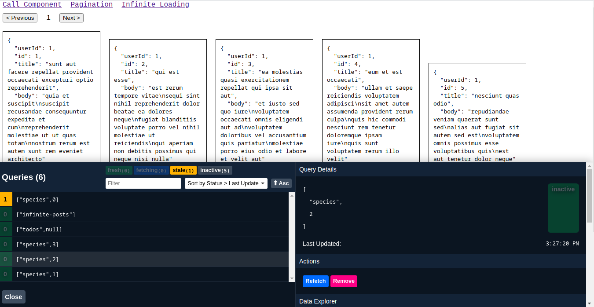

#### Learning `react-query`

Learning React Query library for api requests

```bash
$> yarn install
```

#### Routes

| Route Name     | Route             | Description                                                          |
| -------------- | ----------------- | -------------------------------------------------------------------- |
| Call Component | `/call-component` | Simple React Query (basic)                                           |
| Pagination     | `/`               | This implements pagination using `usePaginatedQuery` hook            |
| Infinite       | `/infinite`       | Try to implement infinite data loading using `useInfiniteQuery` hook |

#### Screenshot
